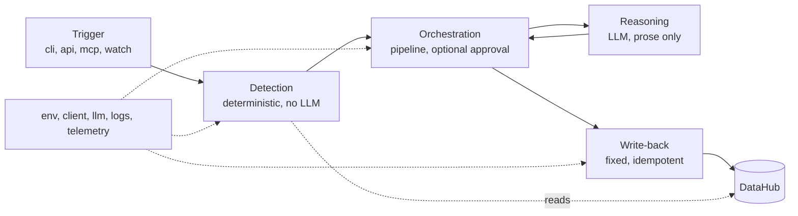

# Architecture

How Janus is built: the layers, what each one may and may not do, how a run
flows through them, and what it reads and writes on DataHub's graph.

This page is about structure. What each check looks for is
[04-detectors.md](04-detectors.md); the threat model is [10-security.md](10-security.md);
commands and flags are on [docs.ahmedxsaad.me](https://docs.ahmedxsaad.me).

## In one paragraph

Janus is a read, reason, write-back loop. A **trigger** starts a run. A
**detection** layer queries column-level and machine learning lineage and returns
typed findings. An **orchestration** layer sequences the work and, on the
human-approval path, pauses for consent. A **reasoning** layer asks a language
model to explain and rank what was found and to draft prose, and nothing else. A
**write-back** layer commits the result to DataHub idempotently. Configuration,
connection handling, logging and telemetry cross-cut all of it.

## The design law

**Detection is deterministic Python. The language model only explains, ranks and
drafts text.** It never decides whether a finding exists, never produces a URN, a
severity, an enum or a dedup key, and never composes a mutation.

Three things follow from that, and they are the reasons for it:

1. **The findings are measurable.** A detector is a pure function of the graph,
   so it can be scored against ground truth and the score means something. See
   [08-evaluation.md](08-evaluation.md).
2. **Prompt injection cannot manufacture a finding.** Catalog text is metadata
   anybody can edit. Because the model runs downstream of detection, a successful
   injection can at worst affect wording. See [10-security.md](10-security.md).
3. **It runs with no language model at all.** A scan with no provider configured
   produces byte-identical detection and deterministic template prose.

## Layer boundaries

These are enforced, not aspirational. Two tests fail if the configuration
boundary is crossed.

| Layer | Package | May do | May not do |
|---|---|---|---|
| Trigger | `cli.py`, `api.py`, `mcp_server.py`, `gate.py`, `mcl.py` | Start a run, parse input, render output | Contain detection logic of its own |
| Detection | `detect/` | Read the graph, return typed findings | Call a language model. Write anything |
| Orchestration | `agent/pipeline.py`, `agent/graph.py` | Sequence, reconcile, gate on approval | Detect. Format graph mutations |
| Reasoning | `agent/narrate.py` | Draft prose from a fact block | Raise. Read the environment. Name a vendor |
| Write-back | `writeback/` | Mutate the graph through fixed functions | Call a language model. Decide anything |
| Adapters | `adapters/` | Parse a declaration file on disk | Connect to any service. Write |
| Seeding | `seed/` | Build demo and benchmark graphs | Be imported by production code |

Three modules are deliberately the only door to something:

- **`env.py`** is the only module that calls `load_dotenv` and the only one that
  touches `os.environ`. Everything else asks it. Identity values (server URLs,
  tokens, API keys, provider names, model ids) get no default and no fallback: a
  fallback in tracked code turns a missing `.env` into a silent connection to the
  wrong place. Algorithm parameters live in `config.py` with documented defaults.
- **`client.py`** is the only factory for `DataHubClient` and `DataHubGraph`. It
  hands both out as one `DataHubConnection` and applies no defaults.
- **`llm.py`** is the only module allowed to import a vendor SDK or name a
  vendor's model. Provider, model and key come from the environment together, all
  three or none.

## Every trigger, one core

`cli.py` exposes `scan`, `watch`, `gate`, `link`, and the read-only sweeps over
them (`inventory`, `coverage`, `finops`, `crosswalk`, `companion`, and the three
document commands). `mcp_server.py` adds a conversational trigger over MCP.
`api.py` adds two functions a training script may call.

Every one of them that runs detection shares the identical
detect, reason, write core in `agent/pipeline.py`. None reimplements it. That is
the invariant; the count of triggers is deliberately not recorded anywhere,
because it has gone stale on every phase that added a command.

Three of them are worth calling out because they are not scans:

- **`link`** runs no detector. It writes the model-to-column join DataHub's own
  ingestion does not produce, and without which the column-level detectors have
  nothing to walk. `link --all` replays every link the graph itself records,
  which is the step after an ingestion run.
- **`gate`** judges a dry-run scan against a policy and answers in an exit code:
  `0` shippable, `1` the policy was violated, `2` the gate could not reach a
  verdict. It reads and does not write by default, because it runs on every push
  and one incident per run would fill the graph with findings about branches that
  never merged. Exit `2` is never a finding: a gate that reports "I could not
  connect" as a violation teaches a team to wave through every red build.
- **`companion`** runs no detector either. It sweeps the assets one owner owns
  for open incidents, failing assertion runs and deprecations.

## Execution modes

| | `scan` | `watch` (poll) | `watch --events` | `gate` |
|---|---|---|---|---|
| Trigger | CLI, CI, cron | Interval timer | DataHub's `MetadataChangeLog` | A pull request |
| Scope | One target or the whole catalog | The watched target | Whatever changed | One model |
| Writes | Yes, or `--dry-run` | Yes, auto-approved | Yes, auto-approved | No, unless `--write` |
| Needs | GMS only | GMS only | A Kafka broker, `[kafka]` extra | GMS only |

Polling is the default and depends on nothing but GMS. The event mode is the
opt-in upgrade, and it does one thing polling structurally cannot: it re-applies,
catalog-wide, any `janus link` an ingestion run dropped. That failure is silent
and is the adoption cliff. DataHub's MLflow source upserts the whole
`mlModelProperties` aspect on every ingest, which drops the features `link`
attached; from that moment the column-level checks have nothing to walk and each
reports "not evaluated" on a model that was fully checked yesterday. Nothing
errors. `reconcile.py` replays only links a human already confirmed, because an
inferred join looks identical to a confirmed one in the graph.

`watch` auto-approves because it is unattended by definition. `scan --review`
pauses after detection and writes only what a human approves, through a LangGraph
`interrupt()`.

## Idempotency

Every write is read-before-write and keyed.

- An **incident's** key is `(resource_urn, incident_type, title)` over the
  resource's currently active incidents. Existing incidents are found by
  traversing the `IncidentOn` relationship inbound; `incidentsSummary` is never
  read, because GMS does not write it, so a dedup based on it silently finds
  nothing and duplicates on every scan.
- A **document's** key is the entity plus the finding type, with a hash of the
  full URN folded into the id so two entities sharing a name cannot overwrite
  each other's card.
- **`run_id` is deliberately not in any key.** It changes every run, so including
  it would make each scan raise a fresh copy of the same finding. It is stamped
  into the body as provenance instead, and it is what ties a write to the
  `dataProcessInstance` that produced it.

The benchmark measures this rather than asserting it: it reruns a scan and reads
the graph back, counting duplicates.

Reconciliation is the other half. A finding that has cleared must close its
incident, clear the tag and recompute the score, and that has to work whether the
recovery is noticed by a long-running `watch`, a fresh `scan`, or a restarted
process. `agent/pipeline.py` reconciles from the graph on every run rather than
from in-process memory. Reconciliation keys on the finding type, not on
`(resource, incident_type)` alone: leakage and a sensitive source both raise a
`FIELD` incident on the same column, and a flatter key would leave a fixed leak
open forever.

## What it reads and writes

Janus reads the metadata graph and nothing else. It never connects to a warehouse
and never issues a query against a table.

| Direction | Aspect or entity | Where |
|---|---|---|
| Read | Column-level lineage (`get_lineage` with a source column) | `detect/column_marks.py`, `detect/blast_radius.py` |
| Read | `operation` (freshness), as a timeseries aspect | `detect/blast_radius.py` |
| Read | `schemaMetadata`, current and the training-time snapshot | `detect/schema_drift.py` |
| Read | Glossary terms and tags (labels, classifications) | `detect/column_marks.py`, `detect/governance.py` |
| Read | `mlModel`, `mlFeature`, training runs, deployments | `detect/graph_reads.py` |
| Read | `deprecation` | `detect/governance.py` |
| Write | Incident (`raiseIncident` GraphQL) | `writeback/incidents.py` |
| Write | Structured properties (trust score, risk flags, run id) | `writeback/properties.py` |
| Write | Tags and glossary terms | `writeback/labels.py`, `writeback/terms.py` |
| Write | Documents (impact report, model card, feature card) | `writeback/documents.py` and siblings |
| Write | Guarding assertion, and the open-assertions YAML | `writeback/assertions.py` |
| Write | The model-to-column join | `writeback/link.py` |
| Write | `dataProcessInstance` for the run itself | `writeback/process_instance.py` |

The complete aspect list, and every rule each write obeys, is
[06-writeback.md](06-writeback.md).

Two constraints from DataHub itself shape the write surface:

- **Incidents cannot attach to an `mlModel`.** `incidentInfo.entities` accepts
  dataset, chart, dashboard, dataFlow, dataJob and schemaField; GMS answers 500
  for a model. Findings therefore land on the data asset, and model-level risk is
  carried as structured properties on the model. Reported upstream, see
  [16-most-valuable-feedback.md](16-most-valuable-feedback.md).
- **Smart and scheduled assertions are DataHub Cloud only**, as is
  `DataHubClient.assertions`. Janus renders portable open-assertions YAML,
  validates it by parsing it back through DataHub's own `AssertionsConfigSpec`,
  and emits `assertionInfo` itself. Detection is its own.

An assertion run event always reports what a detector actually measured on that
run, never a fabricated pass or fail, and `nativeResults` names the source of the
number.

## Model discovery, and the versions search hides

Every model-discovery path goes through `janus/discovery.py`: the bulk sweeps
(`inventory`, `scan --all-models`, `link --all`) and the name-to-URN resolution
behind `--model <name>`.

It exists because of a silent correctness failure rather than a convenience.
DataHub versions entities: registering a second version of an MLflow model
produces a **second** `mlModel` entity and stamps the first one's
`versionProperties.isLatest` to false. GMS then drops every non-latest version
out of search results, while that entity stays perfectly alive, not soft-deleted,
still carrying its aspects and whatever Janus wrote to it.

A model Janus cannot see is a model whose link never replays, whose incident
never closes, and which a cost report would happily recommend deleting a table
for. So the search flag that turns the hiding off is not optional, and it lives
in one module so no caller can forget it. Verified against acryl-datahub 1.6.0.13
and GMS 1.5.0.6.

## Table resolution

`--table` and `--features` accept either a full URN or a bare name. A bare name
is resolved by searching the graph and requiring **exactly one** dataset whose
name matches or ends with it. Ambiguity is an error, never a guess: silently
auditing the wrong table would be worse than failing.

The suffix match is what makes an imported declaration work at all. A declaration
names a relation the way the warehouse does (`analytics.customer_features`) while
DataHub names the dataset with the database in front, so an exact match resolved
against nothing.

## Traversal discipline

Lineage walks are bounded, and the bound is visible in the answer.

- Hop cap from `config.py` (default 3) and a visited set. DataHub returns entities
  beyond `max_hops` once it exceeds 2, because it switches to a full-graph search,
  so the hop count is filtered on rather than trusted.
- Graph reads are batched. No single-fetch-per-entity loops.
- An entity's type is taken from its URN, never from a lineage result's `type`
  field, which is a display string.
- **A walk that hit the result cap with nothing found cannot claim there is
  nothing to find.** It returns `truncated`, distinct from `hop_capped`, and the
  coverage report says which cap actually bound. One means raise the result cap,
  the other means raise the hop cap.

## Positive evidence only

A detector fires on evidence, never on absence. A table that never reported an
`operation` is not stale; a deployment with no properties aspect is not live; an
unparseable source-column property is treated as absent rather than raising out of
the scan.

That rule is correct and, rendered naively to a user, it reads as "healthy".
`detect/coverage.py` exists to close that gap: every check a scan asks for reports
whether it had the metadata to run, and names the missing aspect if it did not. A
scan never reports something healthy that it could not measure.

## Observability

One `logfmt` line per completed scan carrying the `run_id`, the counts, and the
detection time kept separate from the poll interval and from DataHub's own
indexing, because `watch` controls neither. `JANUS_LOG_FORMAT=json` renders the
same facts as structured fields; the facts are assembled once and rendered twice,
so the human line and the indexed fields cannot drift.

`telemetry.py`, behind the `[otel]` extra, exports the same three numbers as OTLP
metrics through a logging handler reading the same record. One measurement, two
renderings, so a metric and a log line cannot disagree about a scan. Three
instruments, no traces, and nothing imported when `JANUS_OTEL_ENDPOINT` is unset.

Finally, the agent records itself. Every scan emits a `dataProcessInstance` under
a Janus `dataFlow` and `scan` `dataJob`, keyed by the same `run_id` that stamps
every write, so the provenance on a write is something a reader can open rather
than a string to grep. A dry run emits nothing.

A full description of both renderings, and of the metrics, is in
[07-reports.md](07-reports.md).

## Errors, and what a failure looks like

Three properties, each of which exists because its absence was a real problem:

- **A configuration mistake fails at startup, naming the variable**, never with a
  stack trace deep inside an SDK call and never with the value in the message.
- **`watch` logs the failure and keeps its message.** A daemon that swallowed the
  error text left an operator with a loop that had silently stopped working and
  nothing to read.
- **The language model has a timeout.** Without one a hanging provider stalls an
  unattended daemon forever. It is deliberately short, because it sits between a
  detected finding and the write that records it.

Typer's locals-in-traceback rendering is pinned off, because those frames hold
the token.

## The desktop surface

`argos/` (in the package) turns the log channel into a JSON event stream on
stdout, consumed by a Tauri window that draws a 32 by 32 pixel watchdog. It is a
renderer and applies no thresholds of its own. See [11-argos.md](11-argos.md).
