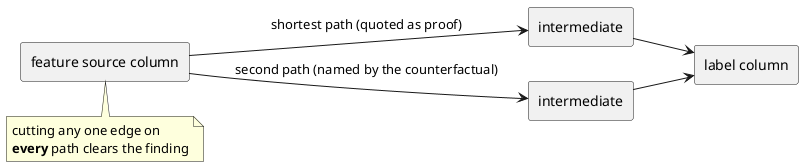

# Janus - Depth Axes

> Where Janus goes deep next, on the axes 03-production-hardening.md does not
> cover: generalizability, evaluation beyond self-scoring, observability of the agent
> itself, explainability, and AI governance. Each item states what it is, why it
> belongs in *this* product rather than another one, the design, what already exists
> to build it on, and how it is verified.
>
> This doc is a plan, not a record. Nothing here is built until it has a
> decision-log entry saying so.

## Status legend

Per root CLAUDE.md rule 7, every SDK symbol named here was introspected against the
installed `acryl-datahub==1.6.0.13` unless marked otherwise.

- `[verified]` introspected against the installed package on 2026-08-04.
- `[confirm]` plausible but unverified. Verify before writing code against it.

---

## 0. The filter: what earns a place here

Janus's moat is one primitive:

> **The evidence is a path in the column graph, and the path is computable without
> touching a row.**

Every good thing in the product today is an application of it. Freshness plus blast
radius is that path walked forward. Leakage is that path walked backward. The
sensitive-source detector (P5) is the same backward walk with a different mark, which
is exactly why it cost almost nothing to add on top of `detect/column_marks.py`.

So the test any proposal has to pass is: **does it reduce to a marked walk over
lineage, or is it a different product wearing this one's name?**

A feature that fails the test costs more than its build time. It dilutes the claim,
it breaks the design law (detection is deterministic, the LLM only explains), and in
several cases it would forfeit the privacy property that no row-level data ever
leaves DataHub. Section 7 lists what this filter rejects, and that list matters as
much as the ones it admits.

---

## 1. Generalizability: does this work on anyone else's catalog?

### 1.0 The honest current answer

Janus generalizes today to any project that has all three of:

1. column-level lineage on the warehouse side (dbt, Spark, and the warehouse
   connectors produce this well),
2. an `mlModel` entity (the mlflow source produces this),
3. **a human who ran `janus link`.**

The first two are common. The third is the cliff. F10 and F11 in
07-weaknesses-and-remedies.md already rate it High severity, adoption class, and
`examples/real-project/` verified live (D-074) that a plain mlflow ingest produces a
model whose training run records no inputs at all.

The consequence is worth stating bluntly, because it governs the priority of
everything else in this document: **every new detector multiplies a coverage number
that is near zero on a stranger's catalog.** Detector count is not the constraint.
The join is.

### 1.1 Read the join from where it already exists (adapters)

**The single highest-value item in this document.**

For a large class of real ML stacks the feature-to-source-column mapping is already
declared, in a file the team already maintains. It is simply not in DataHub. Where
that is true, `link` should import it rather than ask a human to type it a second
time.

| Stack | Where the join already lives | Status |
|---|---|---|
| **Feast** | `FeatureView` declares its source and per-field mapping; the source's `field_mapping` names the underlying column | `datahub.ingestion.source.feast` ships with acryl-datahub `[verified]`; the `feast` package itself is not installed `[verified]`, so this is an extra |
| **dbt semantic models** | `semantic_model` declares entities, dimensions and measures against source columns | `[confirm]` against the dbt manifest schema in use |
| ~~**sklearn `ColumnTransformer`**~~ | ~~`get_feature_names_out()` maps derived feature to input column, in memory, at fit time~~ | **Confirmed against scikit-learn 1.9.0 and it does not** (D-131). It returns transformed names (`num__tenure_months`), never source columns; `PCA` returns `pca0` and destroys the mapping; the label column's *name* is retained nowhere, which is the one argument no inference reaches; and reading any of it needs a fitted estimator in memory, so an adapter would have to unpickle a file, which this package's own rule forbids. `janus.api.link_model`, called from the training script, already serves this need |
| **SageMaker / Vertex feature stores** | Feature group definitions carry source column references | `[confirm]` |

Design:

- A new package `janus/adapters/`, one module per source, each exposing a single
  function returning the same structure `link` already takes: a list of
  `(feature_name, source_column)` pairs plus the label column and the exclusions.
- The adapters are read-only and offline. They parse a repo or a manifest; they do
  not connect to the vendor's service.
- Each is an optional extra (`pip install "janus-datahub[feast]"`), following
  the existing `[agent]`, `[mcp]` provider-extra pattern in `pyproject.toml`.
  Corrected by building it (D-112): *each that needs one*. The dbt adapter reads
  `target/manifest.json`, which is JSON, so it needs no dependency at all and runs
  against a manifest on a machine with no dbt.
- Corrected by building it (D-112): the exclusions are not the adapter's to return.
  A declaration states the features positively and `link` takes the complement, so
  the two are joined against the table's real schema, which lives in DataHub and not
  in the declaration. A declared column the table does not have stops the import
  rather than being filtered out of it.
- Corrected by building it (D-112): Feast *can* declare the label, through a label
  view, and where a repo has one that is the one argument no inference reaches. dbt
  semantic models declare none, and the adapter says so instead of guessing.
- `janus link --from feast --repo ./feature_repo` proposes exactly the way
  `--infer` proposes today: it prints the derivation, says which adapter and which
  declaration each line came from, and writes nothing until the human answers.

Why this is on-thesis: it is the same join, sourced from a better-informed place. It
does not add a detector, it makes every existing detector reach models it currently
cannot see.

Why it matters beyond coverage: it produces an honest new claim for the README, and
it is a far more compelling upstream contribution than a skill file. A Feast adapter
is a thing the DataHub ecosystem does not have.

**Verification:** stand up a minimal Feast repo in `examples/`, import it, and assert
the produced link is byte-identical to the one a human would have typed. Score the
detectors against the resulting graph in `benchmarks/`.

**Effort:** M per adapter. Start with Feast, which has the cleanest declaration.

### 1.2 Continuous reconciliation instead of a replayed command

F11's finding is that `link` decays on every model ingest and has no automation hook.
`link --all` is the manual patch and it requires somebody to remember.

The fix is a **DataHub Action** (a `MetadataChangeLog` consumer) that watches
`mlModelProperties` upserts and re-applies the stored link arguments automatically.
The hard half already exists: the arguments are recorded on the model in an aspect
ingestion does not touch, which is what makes `link --all` need no arguments (D-074).

C.1 in 03-production-hardening.md already names the Actions framework as the
event-driven upgrade path for `watch`; this is the same consumer with a second
handler, so the two land together.

**Verification:** ingest a model twice through DataHub's own mlflow source and assert
the features survive the second ingest with no human action.

**Effort:** M. Depends on the MCL consumer, so sequence it with the `watch` upgrade.

### 1.3 Degrade to a weaker but universal check

Where no link exists at all, a scan currently checks nothing and `coverage.py`
correctly reports why. That is honest but it returns no value on day one.

Add a **table-level degraded mode**, labelled as such in its own output: without
column lineage, Janus can still say that a model's training table is stale,
deprecated, or contains a classified column. It cannot say which feature carries it.

This is precisely the `table-level lineage` row of `benchmarks/baselines.py`, offered
deliberately, with its measured precision printed next to it. ~~The wording below is
what was planned; the sentence that shipped is the one after it, corrected by
building this (D-113).~~

> ~~Checked at table level only (no feature links declared). This mode found 4
> candidate features; measured precision for this mode is 0.25, so three of those
> four are expected to be wrong. Run `janus link` to resolve which.~~

Without a link the model's features are not knowable at all, so a candidate-feature
count would be the *table's* columns presented as the model's inputs. The shipped
finding names the table and quotes the measurement against the question it answers:

> Checked at table level only (credit_risk_v3 declares no features): the table this
> model trains on is past its freshness SLA. Which of the model's features carry the
> stale values is not knowable without a column-level link. Asked which feature
> carries it, table-level reasoning scores a measured precision of 0.25
> (benchmarks/RESULTS.md, table-level baseline), which is why this finding names the
> table and not a feature. Run `janus link` to get the column-level answer
> instead.

That is a tool upselling its own accurate story with its own measured numbers, and it
means `inventory` on a stranger's catalog returns something actionable immediately.
The number is `config.TABLE_LEVEL_PRECISION`, and `run_bench` compares it against the
baseline it measures on every run, so the claim cannot drift from the measurement in
silence (D-113).

**Verification:** the degraded finding must never write an incident at the same
severity as a column-level one, and the benchmark must score the two modes
separately.

**Effort:** S. The traversal exists; this is a mode flag and a distinct finding type.

---

## 2. Evaluation and benchmarking

**What exists:** `benchmarks/` scores against a live DataHub, sweeps the freshness
SLA boundary, compares against two baseline approaches per feature, grades each row
by falsifiability, reads idempotency back from the graph, and measures a scale curve
to 50 models with flat reads-per-model. RESULTS.md states its own limits.

**The gap** is F6, rated High: every number is measured on a graph this project
built, against ground truth this project planted, using baselines this project wrote.
That is not a flaw in the arithmetic, it is a ceiling on what the arithmetic can
claim.

### 2.1 Publish a mutation score for the detectors

**The strongest available answer to "you graded your own homework", and it does not
require better fixtures.**

D-016 already established the principle (mutation-test the suite rather than trust
green checkmarks) and RESULTS.md already records one mutation done by hand: flipping
`>` to `>=` in the freshness comparison is caught by the trial sitting exactly on the
SLA. Make that systematic and publish the number.

Design:

- `mutmut` (3.7.0 on PyPI `[verified]`, not installed) or `cosmic-ray` (8.4.6
  `[verified]`), scoped to `janus/detect/` only. Mutating the whole package
  measures the wrong thing: the claim is about detection.
- Run the offline suite plus the benchmark trials as the test command.
- One generated line in RESULTS.md: mutants generated, killed, survived, with every
  survivor listed and explained.

Why this is different in kind from precision and recall: precision measures whether
the detectors are right about a graph we chose. The mutation score measures
**whether the benchmark has the power to notice a broken detector at all.** A 1.00
precision table plus a mutation score is a categorically stronger claim than a 1.00
precision table, and the two are independent. It is also the mechanical enforcement
of tests/CLAUDE.md rule 6, which currently rests on one hand-run mutation.

**Verification:** a surviving mutant is either a real gap in the trials (fix the
trials) or provably equivalent (document it). Both outcomes are publishable; a
survivor list of zero with no explanation is not.

**Effort:** S to run, M to work the survivor list down.

### 2.2 Build the confusable negatives

Precision of 1.00 is currently close to vacuous, because the negative trials are
*absent positives* rather than *hard negatives*. F6 lists the right four, and each is
a case a real warehouse actually produces:

| Trial | Must fire? | What it catches if wrong |
|---|---|---|
| Feature and label share a **common ancestor**, neither descends from the other | No | The most likely false positive on a real catalog. Untested today. |
| **Diamond**: two distinct paths from feature to label | Yes, quoting the shortest | Non-deterministic evidence. `marked_ancestor` already sorts for this (D-noted in its docstring); nothing proves it. |
| Column **named** like the label, carrying no label term | No | Matching on name instead of on the declared term |
| Leak at exactly `leakage_max_hops`, and at `+1` | Yes, then no, and the scan must say the cap was reached | Off-by-one in the hop cap, plus F1's silent truncation |

Each is a scenario in `janus/seed/scenarios.py` plus a trial in
`benchmarks/inject.py`, following the existing pattern where the benchmark drives the
same reversible scenarios the demo uses (benchmarks/CLAUDE.md rule 1).

**Effort:** M. This is where the precision number starts being worth reading.

### 2.3 Score against a graph this project did not build [done, D-121]

The strongest possible answer to F6, and the most work.

`examples/real-project/` already stands up a real dbt plus MLflow plus postgres
stack. Promote it from a validation exercise to a benchmark target: plant the leak in
the dbt model, ingest with DataHub's own sources, and score the detectors on the
graph **ingestion** produced rather than the graph the seeder wrote.

This measures the thing users actually have. As F6 notes, it would have caught F10
long before a human did. It also doubles as the verification for every item in
section 1.

**Effort:** L.

Built (D-121, T-14). Three corrections from doing it, per docs/CLAUDE.md rule 1:
~~score the detectors~~ only leakage is scoreable on that stack, because there is
no lag, no schema change and no classification in it, and the checks that could
not run are reported as a measured list rather than left silent. The verification
of section 1 needed *two declarations added to the stack* (a dbt semantic model
and a Feast repo), since a warehouse plus dbt plus MLflow declares the
model-to-column join nowhere at all, which is the whole reason `link` exists. And
it did not catch F10: it caught two defects in the readers that close F10 (a
relation named the way a warehouse names it resolved against no dataset, and
Feast's SQL sources hide their table behind a method), plus one in DataHub's dbt
source that made the leak undetectable on a graph that still held it.

### 2.4 Score the narrative deterministically (faithfulness, not quality)

RESULTS.md states that narrative quality is not scored. The reflex is an
LLM-as-judge rubric. Resist it as the first move: it is soft evidence, it varies by
provider, and it sits badly next to a project whose whole posture is that the
decisions are deterministic.

Score **faithfulness** programmatically instead. Every finding already exposes an
`evidence` mapping (`Finding.evidence`, `Mapping[str, str]` `[verified]`), and
`narrate.py` is already forbidden from touching any number in it. So assert it:

1. Every URN appearing in generated prose resolves in the graph. Zero hallucinated
   entities.
2. Every number appearing in generated prose appears in that finding's `evidence`.
3. No number appears in prose that is absent from `evidence`.

Check 3 is the interesting one: it is a hallucination detector for figures, it is a
pure set operation over a regex extraction, and it can run against every provider in
`SUPPORTED_PROVIDERS` in CI. It turns the design law from a rule the code follows
into a property the benchmark measures.

An LLM-as-judge rubric for *readability* can sit on top afterwards, clearly labelled
as the soft metric it is.

**Effort:** S for the three checks. They are worth more than the rubric.

---

## 3. Observability

**What exists:** one logfmt or JSON line per scan carrying `run_id`, both targets,
`dry_run`, counts and phase timings (`janus/logs.py`, D-073). An SLO in C.4
whose three terms are measured rather than estimated. C.3 names OpenTelemetry,
Prometheus and Grafana as the unbuilt upgrade.

Assessment: **OTel and Prometheus are the obvious move and the low-differentiation
one.** Build them, they are cheap, one exporter reading the fields `_log_scan`
already assembles. Do not expect them to score. Two other things on this axis will.

### 3.1 Emit Janus's own runs into DataHub as entities

**The best idea in this document for the Use of DataHub criterion.**

DataHub models processes: `dataFlow`, `dataJob`, and `dataProcessInstance` with
inputs and outputs. Janus already reads `dataProcessInstanceInput` in
`link --infer`, so the shape is familiar.

So represent each scan as what it is: a process run.

- A `dataJob` for Janus's scan, under a `dataFlow` for the agent.
- One `dataProcessInstance` per scan, keyed by the `run_id` every write is already
  stamped with (D-013).
- **Inputs**: the entities the scan read. **Outputs**: the aspects it wrote.
  Corrected by building it (D-111): both aspects accept `dataset` and `mlModel`
  only, per the relationship annotation in DataHub's own model, and a live GMS
  answers 422 for anything else. A column is reported as its parent dataset; the
  incidents, assertions and documents a run writes stay reachable from the asset
  they hang off rather than appearing in the aspect.
- Run status and result via `DataProcessInstanceRunEventClass` and
  `DataProcessInstanceRunResultClass` (`type`, `nativeResultType` `[verified]`),
  with `DataProcessRunStatusClass.STARTED` / `.COMPLETE` `[verified]`.

Symbols confirmed present in the installed package: `DataProcessInstanceKeyClass`,
`DataProcessInstancePropertiesClass`, `DataProcessInstanceInputClass`,
`DataProcessInstanceOutputClass`, `DataProcessInstanceRelationshipsClass`,
`DataProcessInstanceRunEventClass`, `DataProcessInstanceRunResultClass`
`[verified]`. There is **no** high-level `datahub.sdk` wrapper for this entity
`[verified]`, so emission goes through `MetadataChangeProposalWrapper`, which
`writeback/` already uses in seven places. A higher-level helper exists at
`datahub.api.entities.dataprocess.dataprocess_instance` `[verified]`; evaluate it
before hand-rolling the MCPs.

What this buys, and it is disproportionate to the effort:

- The agent's operational history becomes queryable and lineage-visible **in the same
  graph it guards**, with no new dependency, no scrape endpoint, and no second system
  to run.
- Every incident becomes traceable to the run that produced it, in the UI, by
  clicking, rather than by grepping a log for a `run_id`.
- **Janus becomes subject to its own thesis**: a process whose inputs and
  outputs are catalogued, whose freshness can be checked, and which is visible to
  anyone auditing the graph. That is the product's own argument, applied to itself.
- It is the strongest available evidence of composing DataHub's shipped features
  rather than rebuilding them, which is the explicit wording of the Originality
  criterion.

**Verification:** after a scan, the process instance is readable from the graph, its
inputs match the entities read, its outputs match the aspects written, and a rerun
with the same `run_id` produces no duplicate (the existing idempotency law applies
here too).

**Effort:** S to M.

### 3.2 Guard coverage as a trended metric

`detect/coverage.py` already computes, per model, which checks could not run and
why. Nothing aggregates it.

Aggregate it into a catalog-level figure and trend it the way `writeback/
trust_history.py` already trends scores:

> Guard coverage: 34% of models have a checkable leakage path (up from 11%), 61%
> have a freshness signal, 8% have a training schema snapshot.

This is the number a data platform lead reports upward, and nothing in the ecosystem
produces it. It also reframes the adoption cliff from an embarrassment into the
product's own roadmap: Janus measures how observable your ML estate is, then
tells you the specific next join that would raise it most.

**Effort:** S. The per-model computation exists; this is aggregation plus a history
write.

### 3.3 OpenTelemetry and Prometheus, behind an extra

Do it, keep it small, do not oversell it. One exporter reading the fields `_log_scan`
already assembles, behind `[otel]`, off by default. C.3 already describes the upgrade
path correctly; this is executing it.

**Effort:** S.

---

## 4. Explainability (xAI)

### 4.0 What this axis is not

**Do not add SHAP, LIME, or feature-importance analysis.** They require row-level
data and model access. That would:

- break the property that no row-level data ever leaves DataHub, currently one of the
  strongest and most quotable things in the README,
- put Janus in direct competition with mature tools, while abandoning the one
  thing only it can do,
- and require a warehouse connection the security model explicitly rules out.

It would be a strictly negative trade. The reframe is that Janus does not
explain a model's *prediction*; it explains a **finding** and a **feature**,
structurally, from provenance. That is an under-served form of explanation with real
literature behind it, and it is computable from the graph alone.

### 4.1 Counterfactual remediation: the minimal graph change that clears the finding

**The highest impressiveness-to-effort ratio in this document.**

For every finding, compute and publish the smallest set of changes that would make it
go away:

```
This finding clears if any one of these holds:
  - the edge applicant_income <- loans_raw.income is removed, or
  - the feature applicant_income is dropped from credit_risk_v3, or
  - loans_raw.income stops carrying the label term.

The shortest contaminating path is 2 hops. There is one other path, at 4 hops
(applicant_income <- income_band <- income_bucket <- loans_raw.income), which
would also need removing.
```

Why it is on-thesis:

- It is exactly the **counterfactual explanation** of the xAI literature (Wachter,
  Mittelstadt and Russell, 2017, *Counterfactual Explanations Without Opening the
  Black Box*), applied to a lineage graph rather than to a feature vector. It gets
  cited honestly the way each detector already cites its paper.
- Fully deterministic, computed from the traversal that already runs. No LLM, no new
  data source. The design law holds exactly.
- It turns every incident from **descriptive** into **actionable**: not just what is
  wrong, but what to change, with a proof that changing it works.
- It closes the loop with the headline benchmark column. RESULTS.md's money column is
  "still alerting after the fix". A counterfactual **is** the fix, stated in advance.
  Janus would be the tool that names the remediation and then verifies it
  cleared. No table-level approach can even express this, because it never saw the
  column edge.
- The "there is one other path" clause advertises the moat inside every incident a
  user reads.

**The design is smaller than it looks.** `marked_ancestor`
(`janus/detect/column_marks.py:179`) already collects **every** chain from a
feature's source column to a marked ancestor and returns only the shortest, sorting
deterministically so the quoted proof is stable. The other chains are computed and
then discarded. So:

1. Widen `WalkResult` to carry all chains, not only the winner. The shortest stays
   the one quoted, so no existing output changes.
2. Derive the counterfactual set from them: the union of first edges is the "remove
   this edge" option; the feature itself is the "drop this feature" option; the
   marked column is the "unmark" option.
3. Render it in the incident body and the impact report, next to the existing proof.

Conceptually:



Apply the same shape to the other detectors: a freshness finding clears when the
table refreshes inside the SLA or the model stops consuming it; a sensitive-source
finding clears when the derivation is cut or the classification is corrected; a
deprecated-input finding clears when the model moves to the successor the deprecation
note names.

**Verification:** for each counterfactual the benchmark *applies* it to the graph and
asserts the finding clears. That is a stronger test than any assertion about the
text, and it is the natural extension of the existing revert scenarios.

**Effort:** S to M. It is a widened return type, a derivation, and a renderer.

### 4.2 Feature provenance cards

For each `MLFeature`, generate a document and write it back: the full derivation
chain to source columns, the tables it transitively depends on, each one's freshness,
its classification exposure, its drift history, and its counterfactual set if it
carries a finding.

This is a **Data Card** (Pushkarna, Zaldivar and Kjartansson, *Data Cards*, FAccT
2022) for a feature, assembled entirely from measured graph facts. It answers "where
does this feature actually come from", which every data scientist asks and nothing
today answers.

It reuses `writeback/documents.py`, which already renders and writes impact reports
keyed for idempotency.

**Effort:** M.

### 4.3 Trust score as a waterfall, not an integer

F7 already prescribes this: lead with the deductions, de-emphasise the integer.
Render it contrastively, with each deduction linking to the finding that caused it:

```
100  starting
 -30  target leakage (applicant_income)
 -15  stale input (loans_raw, 30h against a 6h SLA)
 -10  no owner
----
 45  at risk
```

Do this one regardless of anything else in this document. It implements a fix the
project's own audit already called for, and it costs almost nothing because
`detect/trust_score.py` already computes the deductions.

Pair it with F7's other three prescriptions (a `SCORING_VERSION` stamped into every
history entry, `--min-trust` documented as the blunt secondary control, and the
provenance sentence stating that the weights are a stated preference ordering rather
than a calibrated model).

**Effort:** S.

---

## 5. AI governance and safety

**What exists:** P5 sensitive source and P6 deprecated input (`detect/
governance.py`), the OWASP LLM01/05/06 controls audited against the code rather than
assumed (D-049, which found and fixed a real delimiter-escape hole), and a
`run_id`-stamped audit trail on every write.

The depth move here is not more controls. It is **making the graph produce the
artifact a compliance function actually has to file.**

### 5.1 Proxy-attribute detection

**The most novel item in this document.**

Today P5 detects a feature that *descends from* a column classified as sensitive.
Extend it to features that descend from a column **strongly co-determined with** a
protected attribute without descending from it. The classic cases: postcode as a
proxy for race, given name for gender, device type for income.

Structurally this is one more question of the same graph:

> feature X and protected attribute A share a common ancestor within k hops, and X
> does not descend from A.

That is the walk `column_marks.py` already performs, with the index it already
builds. Note that this is the same graph shape as the common-ancestor negative trial
in 2.2, read for the opposite purpose, so the two land naturally together.

**The design constraint is the whole feature, and it must be built in from the
start: this is reported as a proxy candidate for human review, never asserted as
discrimination.** The posture is P5's exactly, which reports "not evaluated" rather
than "clean" when unconfigured. A tool that told a team it was discriminating, on
lineage alone, with no access to the data or the predictions, would be wrong and
harmful. A tool that says "these three features share an ancestor with a column your
organization classified as a protected attribute; a human should decide whether that
is proxying" is genuinely useful and honest about its limits. Severity caps at
`medium` for the same reason P6 does: it is a prompt to look, not a defect.

Literature: Barocas and Selbst, *Big Data's Disparate Impact* (California Law Review,
2016), on proxy variables as the dominant mechanism of unintentional discrimination.
Add to `docs/plan/resources.md` with what it changed here, per the existing
convention.

The structural claim worth stating in the README: **fairness tooling today needs the
data and the predictions. This needs neither, and it runs before the model is
trained.** That is defensible, novel, and it is the moat again.

**Verification:** a positive trial (feature and protected attribute sharing an
ancestor), and the two negatives that matter (direct descent, which is P5's job and
must not be double-reported; and an unrelated common ancestor beyond k hops).

**Effort:** M.

### 5.2 An EU AI Act Article 10 evidence pack

Article 10 requires, for high-risk systems, documented training-data provenance,
governance, and examination for bias. Article 12 requires record-keeping. The Act's
obligations phase in through 2026, so this is live rather than hypothetical.

Janus already computes most of the required evidence: training data sources,
column-level provenance, classification exposures, freshness at training time, schema
at training time, deprecated inputs, ownership. Assemble it per model into a
generated document written back into DataHub.

**The framing is what makes it credible, and getting it wrong makes it worse than
useless.** This is *an evidence pack assembled from measured facts*, not a compliance
certification. The artifact says so in its own first paragraph, and it lists what it
could **not** establish as prominently as what it could, reusing `coverage.py`'s
existing not-evaluated discipline. A generated document that implied conformity would
be the single most damaging thing this project could ship.

**Effort:** M. Mostly a renderer over facts that already exist.

### 5.3 Generated model cards

`detect/trust_score.py` already cites Mitchell et al. 2019 for the model-card idea.
Generate the actual artifact from graph facts and write it back as a document:
intended use where declared, training data provenance, the trust score with its
waterfall, known findings, and the checks that could not run.

Cheap, recognized, and it slots into the document write-back that already exists.

**Effort:** S.

### 5.4 A NIST AI RMF crosswalk

Currently a name-drop in 03-production-hardening.md section D.6. Turn it into a
generated table: each detector mapped to the MAP, MEASURE or MANAGE subcategory it
produces evidence for. It converts a claim into an artifact, and it is an afternoon.

**Effort:** S.

---

## 6. Two axes not on the original list

### 6.1 FinOps: pipelines feeding models nobody uses

Blast radius already knows which pipelines feed which models. `discovery.py` already
knows which models exist, including the non-latest versions search hides. Intersect
them:

> These 6 dbt models and 2 Spark jobs exist only to feed `churn_model_v2`, which no
> deployment has consumed in 90 days.

That is money, it is computed entirely from lineage already walked, and it reaches a
budget holder rather than an engineer. High value per line of code.

**Effort:** S to M.

### 6.2 Incident lifecycle: MTTR from Janus's own writes

Janus raises incidents and resolves them (D-067, D-069). It does not measure how
long they stayed open. Mean time to resolution per finding type, read straight from
the writes already in the graph, closes the SRE loop C.4 opened and costs almost
nothing. It also produces the evidence that the tool works over weeks rather than in
a demo.

**Effort:** S.

---

## 7. Deliberately not building

Recording these matters as much as the list above, because each is a plausible-
sounding idea that fails the section 0 filter.

| Rejected | Why |
|---|---|
| **SHAP / LIME / feature importance** | Needs row-level data and model access. Forfeits the no-rows-to-the-LLM property, duplicates mature tools, abandons the moat. See 4.0. |
| **A Grafana dashboard** | A picture of a picture. The `dataProcessInstance` history in 3.1 renders in DataHub's own UI, is more on-thesis, and adds no dependency. |
| **LLM-as-judge as the primary narrative metric** | Soft evidence, provider-dependent, and it sits badly beside a project whose posture is deterministic decisions. The faithfulness checks in 2.4 are strictly stronger. Keep the rubric as a labelled secondary. |
| **Statistical drift detection on values** (PSI, KL divergence) | Needs the rows. Schema drift is the metadata-computable half and it is already built. |
| **Rebuilding search, lineage browsing, or a catalog UI** | The Originality criterion explicitly rejects rebuilding shipped DataHub features. Compose them. |
| **A purpose-limitation / consent detector** | Requires a purpose taxonomy in the catalog that no real deployment has. Revisit if one appears. |

---

## 8. Ranked shortlist

If only five things get built, these, in this order.

| # | Item | Section | Why it wins | Effort |
|---|---|---|---|---|
| 1 | Counterfactual remediation | 4.1 | Descriptive incidents become actionable; closes the loop with the headline "still alerting after the fix" metric; the walk already computes what it needs | S/M |
| 2 | Scans as `dataProcessInstance` | 3.1 | Dogfoods the product's own thesis inside the graph it guards; no new dependency | S/M |
| 3 | Feast and dbt link adapters | 1.1 | Removes the adoption cliff for whole stacks; worth more than any new detector | M |
| 4 | Proxy-attribute detection | 5.1 | Genuinely novel, needs neither data nor model, real literature, same walk | M |
| 5 | Mutation score plus confusable negatives | 2.1, 2.2 | The only real answer to "you graded your own homework" | M |

Everything else here is worth building, and none of it is worth building before these
five.

### Suggested order

1. **4.3 trust waterfall** and **5.4 crosswalk** first. Both are S, both implement
   fixes the project's own audits already prescribed, and both are pure gain.
2. **4.1 counterfactual.** The flagship. Widen `WalkResult`, derive, render, and have
   the benchmark apply each counterfactual and assert the finding clears.
3. **3.1 process instances.** Independent of everything else; land it whenever.
4. **1.1 Feast adapter**, then **1.3 degraded mode**. Coverage is the constraint;
   these lift it.
5. **2.1 and 2.2** together. The mutation survivors will point at exactly which
   confusable negatives are missing, so run mutation first and let it write the list.
6. **5.1 proxy detection**, which reuses 2.2's common-ancestor scenario.
7. **2.3 score on an ingested graph.** The largest item, and the verification for all
   of section 1.
8. Everything remaining, by effort.

---

## Change log

| Date | Author | Change |
|---|---|---|
| 2026-08-04 | Claude (for Ghassen Naouar) | Initial version: the five depth axes, the section 0 filter, the rejected list, and the ranked shortlist (D-106) |
| 2026-08-04 | Claude (for Ghassen Naouar) | Section 2.3 corrected in place per docs/CLAUDE.md rule 1 by building it: only leakage is scoreable on the ingested stack, the section-1 verification needed two declarations added to that stack, and what the exercise caught was not F10 but three defects nothing else would have found (D-121, T-14) |
