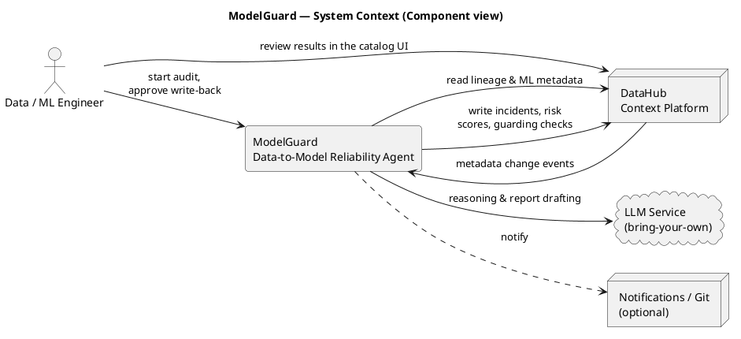
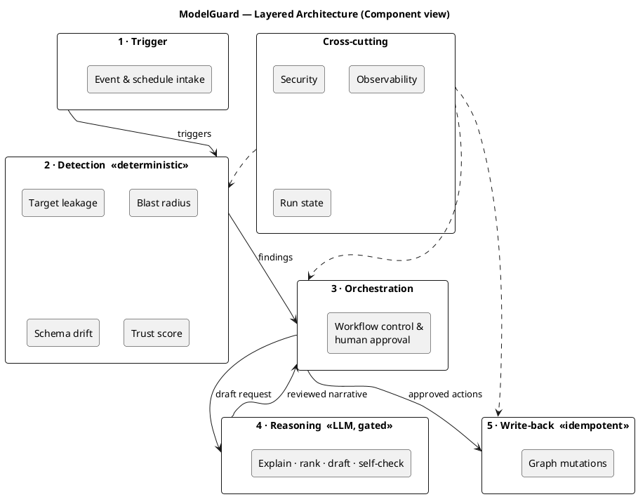
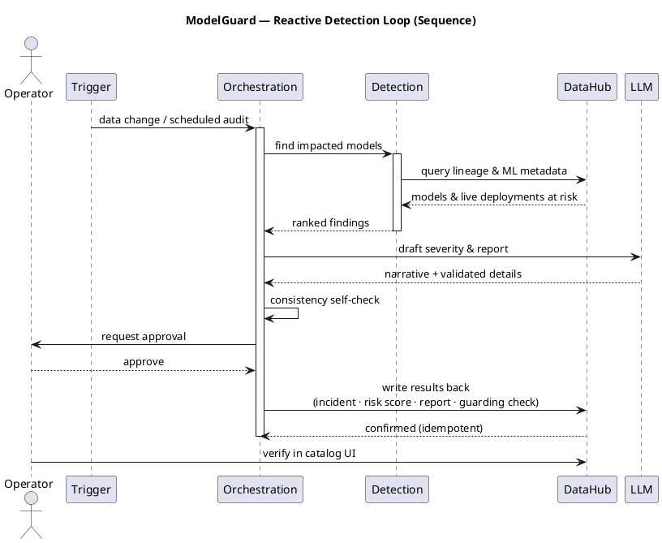
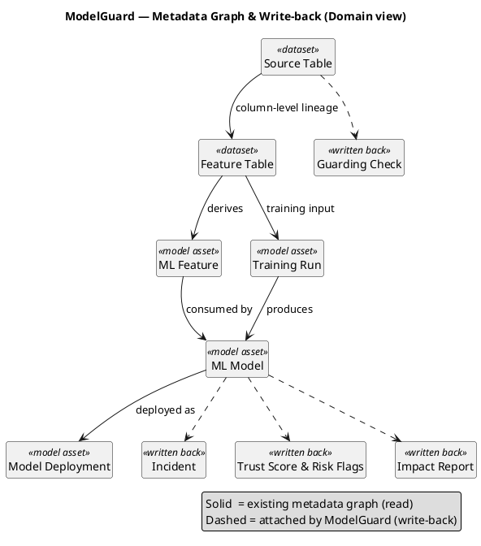
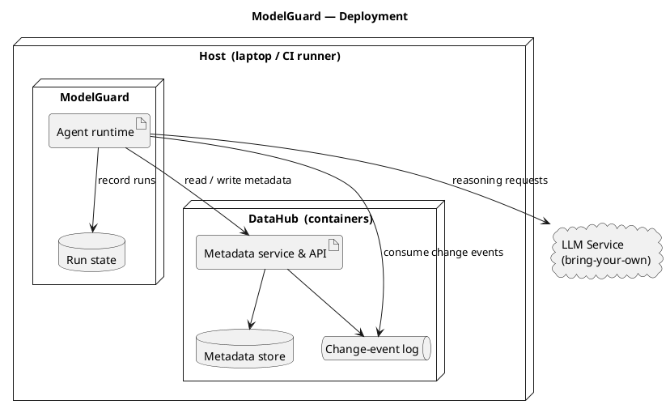

# ModelGuard — Architecture

> How ModelGuard actually works, in detail: the system context, the internal layers, each component's job,
> the runtime flows, and the read/write data plane over DataHub's graph. Companion to
> `02-implementation-plan.md` (build steps) and `03-production-hardening.md` (scaling/security/benchmark).
>
> Diagrams are **PlantUML** (standard UML: component, sequence, class, deployment). Render them with the
> PlantUML extension for VS Code / IntelliJ, or paste the source into `www.plantuml.com/plantuml`. They are
> intentionally **conceptual** — no file names, no code — because they describe *structure and behaviour*,
> not the implementation (that lives in `02-implementation-plan.md`). An ASCII fallback of the core loop is
> in `02-implementation-plan.md §0`.

---

## 1. One-paragraph model

ModelGuard is a **read → reason → write-back loop** that sits on the boundary between the **warehouse graph**
and the **ML graph** — the one place DataHub uniquely holds both. A **trigger** (an event or a scheduled scan)
starts a run. A **deterministic detection layer** queries DataHub's column-level + ML lineage to find silent
data→model failures. An **orchestration layer** (LangGraph) sequences the work and pauses for human approval.
A **reasoning layer** (LLM) explains and ranks findings and drafts human-readable artifacts — but never
decides *whether* a problem exists and never composes raw mutations. A **write-back layer** commits the
results (incidents, structured properties, tags, documents, guarding assertions) back into DataHub,
idempotently. Everything is observable and least-privilege.

---

## 2. Design tenets (why the shape is what it is)

- **Deterministic detection, generative narration.** Detection is pure Python over the graph; the LLM only
  explains, ranks, and writes prose. → reproducible metrics, injection-resistant, cheap. (See tenet rationale
  in Anthropic *Building Effective Agents* and OWASP LLM01 in `resources.md`.)
- **Contribute back to the graph.** Every run's value is a *write*, not a chat reply — the top judging signal.
- **Idempotent by construction.** Writes are keyed by `(resourceUrn, finding_type, run_id)`; reruns converge.
- **Human-in-the-loop for agency.** A LangGraph `interrupt()` gates every mutation (auto-approve only for the
  recorded demo). Defends OWASP LLM06 (excessive agency).
- **Metadata-only, never raw rows.** ModelGuard reads DataHub's metadata/profile aspects, never PHI/PII rows —
  a hard privacy boundary for the finance/healthcare framing.
- **Two triggers, one core.** `scan` (batch) and `watch` (event-driven) share the exact same detect→write core.
- **Compose, don't rebuild.** Reuse DataHub's lineage, ML entities, incidents, structured properties, and the
  Agent Context Kit toolset; add only the ML-reasoning + write orchestration that doesn't exist yet.

---

## 3. System context (who talks to what)

---

## 4. Internal architecture (the six layers)

---

## 5. Component catalog

### ① Trigger layer (`agent/`, `cli.py`, `seed/scenarios.py`)
- **MCL consumer (`watch`)** — subscribes to DataHub's `MetadataChangeLog` via the Actions framework (Kafka
  consumer group, at-least-once). Filters to interesting aspects: `schemaMetadata`, assertion results,
  `datasetProfile`, `operation`. Emits a `Trigger{entity_urn, change_type}` onto the core. Falls back to
  **polling** (query recently-changed entities) when Kafka isn't wired.
- **Scheduler/CLI (`scan`)** — `modelguard scan [--model URN | --all]` enumerates models and runs the full
  detector suite; ideal for CI and the demo's "before" state.
- **Scenario injector** — deterministically plants a failure (stale column, leakage feature, schema rename)
  for the demo and the benchmark; shared with `benchmarks/inject.py`.

### ② Detection layer (`detect/`) — *no LLM here*
- **`leakage.py` (P1)** — for each model, walks `Model → Features → (ML sources) → source columns`, then for
  each feature source column runs `get_lineage(source_column=…, direction="upstream")` and checks whether the
  upstream **column cone** intersects the declared **label column's** cone (or crosses the prediction-time
  boundary). Output: `LeakageFinding{feature, offending_path}`.
- **`blast_radius.py` (P2)** — from a failing/changed table, traverses **downstream across the warehouse→ML
  boundary** (dataset→dataset column lineage + ML `sources`/`Consumes`/deployment edges) with a hop cap, and
  collects every `mlModel` + live `mlModelDeployment`. Output: ranked `AtRisk[]` (severity = deployment status
  × fan-out × ownership).
- **`schema_drift.py` (P3)** — reads the training run's input-schema **as-of** the run timestamp (Timeline /
  Schema-History API) vs the source's current `schemaMetadata`; diffs added/removed/retyped columns. Output:
  `DriftFinding{training_run, drifted_fields}`.
- **`trust_score.py` (P4)** — aggregates P1–P3 + freshness lag + ownership into a 0–100 score and a risk band.
  Output: `TrustScore{value, flags, rationale_inputs}`.

Detectors are **pure functions** of the graph → unit-testable, deterministic, and directly measurable by
`benchmarks/` (see `03-production-hardening.md §A`).

### ③ Orchestration layer (`agent/graph.py`) — LangGraph
- Defines the `StateGraph`: `detect → investigate → reason_and_score → [human_approval] → write_back → END`.
- **Checkpointer** persists state so a run is replayable/inspectable (great for demos and debugging).
- **`interrupt()`** pauses before any write and surfaces the proposed mutations for approval; `--auto-approve`
  bypasses only for the recorded run.
- Owns retry/backoff + circuit-breaker policy around GMS calls.

### ④ Reasoning layer (`agent/tools.py` + prompts) — the LLM, gated
- Turns structured findings into **ranked severity + narrative**, drafts **incident text** and the
  **Model Impact Report** (a blameless-postmortem-style doc), and writes the **trust-score rationale**.
- Runs a **self-check** (Reflexion-style): every URN it emits must resolve in the graph; enum values and
  numbers are validated before hand-off. The LLM **selects** among pre-built write functions and supplies
  **validated arguments** — it never emits raw GraphQL (defends OWASP LLM05).
- Reads metadata strictly as delimited **untrusted data**, never as instructions (defends OWASP LLM01).

### ⑤ Write-back layer (`writeback/`) — idempotent, parameterized
- **`incidents.py`** — `raiseIncident` / `updateIncidentStatus` via `graph.execute_graphql` (OSS-native).
- **`properties.py`** — define (`datahub properties upsert`) + assign (`upsertStructuredProperties`) the
  `modelguard.trust_score` / `modelguard.risk_flags` / `modelguard.run_id` properties.
- **`labels.py`** — `add_tags` / `add_terms` / `add_owners` (SDK for scripts; MCP tools for the agent path).
- **`documents.py`** — `save_document` attaches the impact report to the model.
- **`assertions.py`** — emits guarding assertions as **open-assertions YAML** (+ optional **ODCS contract**),
  and creates the assertion entity so it shows in the Quality tab.
- **Idempotency:** every writer does read-before-write on the dedup key; reruns never duplicate.

### ⑥ Cross-cutting (`client.py`, observability, state)
- **`client.py`** — builds `DataHubClient` / `DataHubGraph` from env; loads the **least-privilege PAT**.
- **Observability** — OpenTelemetry spans per node, Prometheus counters (findings, incidents, suppressed FPs,
  GMS latency), structured JSON logs correlated by `run_id`.
- **Run-state store** — SQLite (demo) → Postgres (scale) holding run history + the open-incident index for
  idempotency and "what changed since last run" diffs.

---

## 6. Runtime flow — the reactive core loop (Problem 2)

**Preventive scan (P1 leakage / P3 drift)** is the same spine without the Kafka trigger: `modelguard scan
--all` → for each model run `leakage` + `schema_drift` + `trust_score` → reason → approve → write-back. This is
the "audit before promotion" story and the benchmark entry point.

---

## 7. Data plane — what ModelGuard reads and writes

| Direction | Entity / aspect | API | Where in code |
|---|---|---|---|
| **Read** | column-level lineage | `client.lineage.get_lineage(source_column=…)` | `detect/leakage.py`, `blast_radius.py` |
| **Read** | ML entities (feature/model/run/deployment) | `get_entities`, relationship queries | `detect/*` |
| **Read** | schema history | Timeline API `--category TECHNICAL_SCHEMA` | `detect/schema_drift.py` |
| **Read** | profiles / freshness | `datasetProfile`, `operation` aspects | `detect/blast_radius.py`, `trust_score.py` |
| **Write** | incident | `raiseIncident` GraphQL | `writeback/incidents.py` |
| **Write** | trust score / flags / run id | `upsertStructuredProperties` | `writeback/properties.py` |
| **Write** | tags / terms | MCP mutations / SDK | `writeback/labels.py` |
| **Write** | impact report | `save_document` | `writeback/documents.py` |
| **Write** | guarding assertion / contract | open-assertions YAML + entity; ODCS | `writeback/assertions.py` |

---

## 8. Execution modes

| | `scan` (batch) | `watch` (event-driven) |
|---|---|---|
| **Trigger** | cron / CLI / CI | DataHub `MetadataChangeLog` (Kafka) + polling fallback |
| **Scope** | all models (or one) | only the changed entity's downstream cone (incremental) |
| **Use** | audit-before-promotion, CI gate, demo "before", benchmark | always-on on-call sentinel, demo "3 AM" moment |
| **Core** | identical detect → reason → write-back | identical |
| **Build order** | first (bulletproof) | second (adds Kafka; keep polling fallback) |

---

## 9. Cross-cutting concerns (details in `03-production-hardening.md`)

- **Security** (§D): least-privilege PAT; prompt-injection-resistant deterministic detection; human-gated,
  parameterized writes; output validation; metadata-only (no raw PHI/PII to the LLM); full audit trail via
  `run_id`.
- **Scaling** (§C): bounded traversal + memoization + batched reads; at-least-once + idempotent = effectively
  once; backpressure/rate-limit/circuit-breaker on GMS; stateless workers partitioned by domain.
- **Observability** (§C.3) & **benchmark** (§A): OTel + Prometheus; ModelGuard-Bench measures detector
  precision/recall/MTTD and beats the no-lineage baselines.

---

## 10. Deployment view

- **Demo/judge deployment:** one `quickstart.sh` boots DataHub, loads a datapack, seeds the ML graph, and runs
  `modelguard scan`. Zero external infra except the LLM API key.
- **"Production" posture:** the same image scales out as stateless workers against a shared DataHub + Postgres
  run-state; `watch` mode reads the MCL Kafka topic via a consumer group.

---

## 11. Key design decisions (ADR-style)

| Decision | Alternative rejected | Why |
|---|---|---|
| Deterministic detection, LLM only for narration | LLM decides findings | Reproducible metrics; injection-resistant; cheaper; testable. |
| LangGraph orchestration | bare `AgentExecutor` / cron script | Native human-in-the-loop `interrupt()`, checkpointing/replay, explicit node order. |
| Incidents via `execute_graphql` | wait for Python SDK wrapper | SDK wrapper is "coming soon"; GraphQL works in OSS today. |
| Guarding assertions as open-assertions YAML + entity | depend on Cloud smart assertions | Cloud-gated; OSS spec is portable and judge-runnable. |
| `scan` first, `watch` second | build event-driven first | Kafka/Actions adds risk; a bulletproof batch core de-risks the demo. |
| Metadata-only reads | pull sample rows for profiling | Privacy (PHI/PII) + reuse DataHub's existing profile aspects. |
| Idempotent writes keyed by `run_id` | fire-and-forget writes | Reruns/at-least-once delivery must not duplicate incidents. |
| Seed a small ML graph via SDK | rely on datapacks | Datapacks are warehouse/BI-only; ML entities must be seeded (Week-1 gate). |
